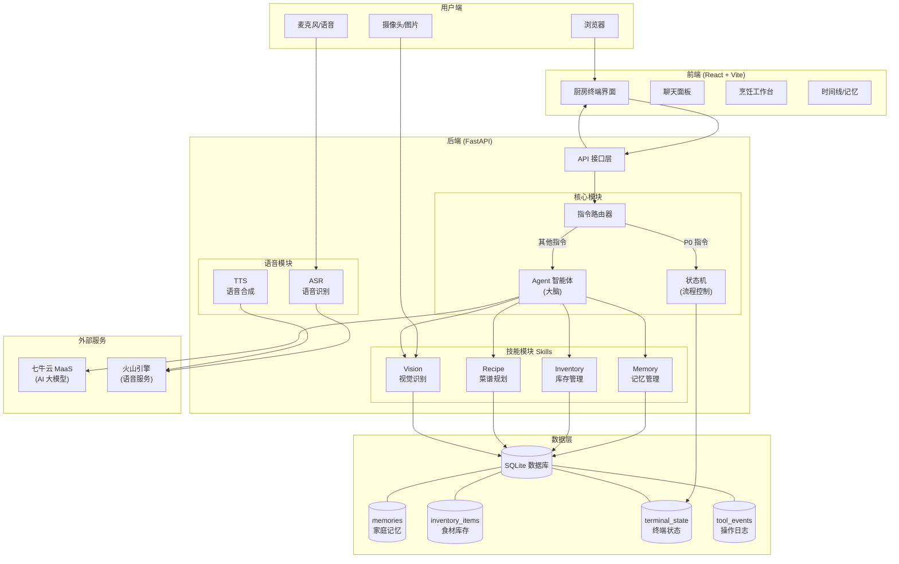
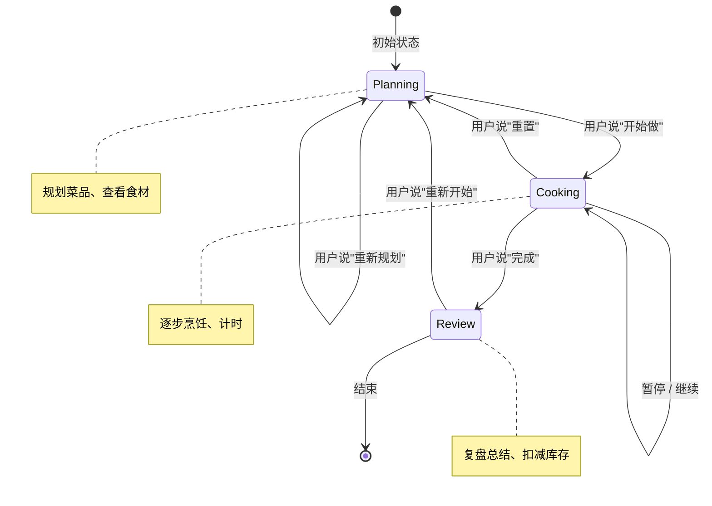
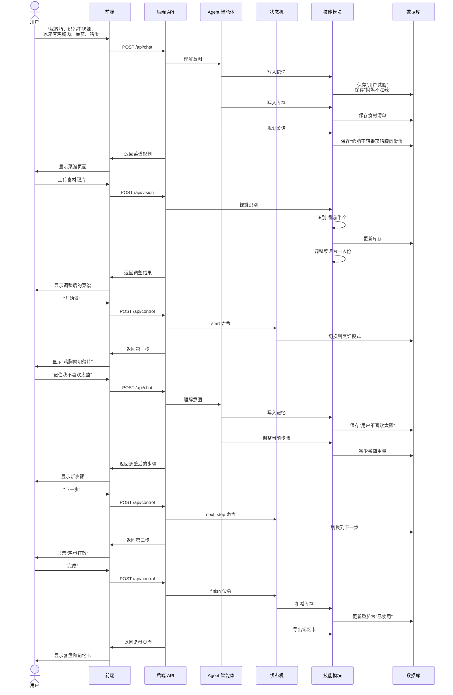
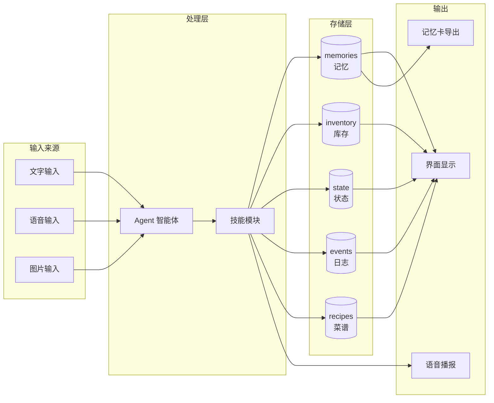
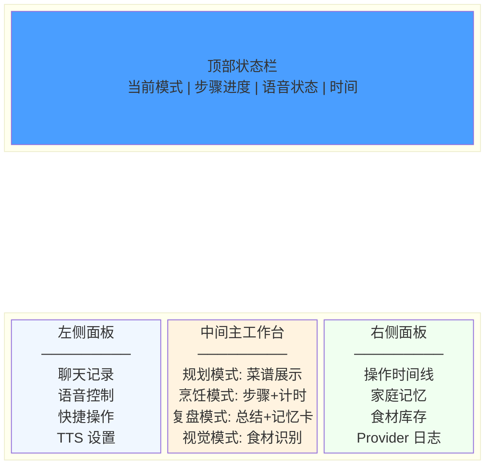

# Nini Kitchen Agent 项目介绍

## 一句话概括

**Nini 是一个厨房里的 AI 助手**，它能帮你从"今晚吃什么"到"做好开吃"的全过程。

---

## 这个项目解决什么问题？

想象一下这个场景：

> 你下班回家，打开冰箱发现有鸡胸肉、番茄和鸡蛋。你想做顿饭，但有几个问题：
> - 你在减脂，不能吃太油
> - 妈妈不吃辣
> - 番茄只有半个，够不够用？
> - 做到一半忘了下一步是什么

普通的菜谱 App 只会给你一个固定步骤，**不会根据你的实际情况调整**。

Nini 就是为了解决这个问题而生的——它像一个真正懂你家厨房的助手，能根据你的口味、食材、进度，实时给出建议。

---

## Nini 能做什么？

### 1. 记住你的口味偏好

你告诉它"我在减脂"、"妈妈不吃辣"，它会**记住这些信息**，下次规划菜品时自动考虑。

### 2. 根据食材规划菜品

你说"冰箱里有鸡胸肉、番茄、鸡蛋"，它会结合你的口味，推荐一道"低脂不辣番茄鸡胸肉滑蛋"。

### 3. 识别真实食材

你拍一张冰箱照片给它，它会识别出"番茄只有半个"，然后**自动调整菜谱**，把两人份改成一人份。

### 4. 一步一步教你做

进入烹饪模式后，它会：
- 告诉你现在该做什么（"把鸡胸肉切成薄片"）
- 帮你计时（"这一步需要 3 分钟"）
- 你说"下一步"就切换到下一步
- 你说"暂停"就暂停计时

### 5. 实时响应你的需求

做饭过程中你说"记住我不喜欢太酸"，它会**立刻记住**，并在当前步骤中减少番茄用量。

### 6. 生成复盘记录

做完饭后，它会：
- 扣减库存（番茄用掉了）
- 生成一张"家庭记忆卡"，记录这次做饭的经验

---

## 系统架构图



## 项目目录结构

```
nini/
├── backend/          # 后端：大脑和神经系统
│   ├── app.py        # API 接口入口
│   ├── agent/        # AI 智能体（思考和决策）
│   ├── skills/       # 技能模块（记忆、库存、菜谱、视觉）
│   ├── terminal/     # 状态机（控制烹饪流程）
│   ├── speech/       # 语音识别和合成
│   └── database.py   # 数据库（存储所有信息）
│
├── frontend/         # 前端：用户看到的界面
│   └── src/
│       ├── App.jsx   # 主界面
│       └── components/  # 各种组件
│
├── docs/             # 文档（你现在看的就是）
└── scripts/          # 测试和演示脚本
```

---

## 核心概念解释

### 什么是"Agent"？

Agent 就是 AI 助手的"大脑"。当你输入一句话时：
1. Agent 会理解你的意思
2. 决定要调用哪个技能（比如写入记忆、规划菜谱）
3. 返回结构化的指令给系统执行

**关键点**：Agent 只负责"想"，不直接"做"。所有实际操作都由后端的技能模块执行。

### 什么是"状态机"？

状态机是一个**确定性的流程控制器**，它管理烹饪过程中的状态变化：



**关键点**：像"下一步"、"暂停"、"继续"这些高频操作，**不经过 AI 大模型**，直接由状态机处理，响应更快更稳定。

### 什么是"技能模块"（Skills）？

技能模块是后端的各个功能单元：

| 技能 | 功能 | 举例 |
|------|------|------|
| Memory | 记忆管理 | 记住"妈妈不吃辣" |
| Inventory | 库存管理 | 记录"番茄有2个" |
| Recipe | 菜谱规划 | 生成"低脂不辣番茄鸡胸肉滑蛋" |
| Vision | 视觉识别 | 识别照片中的食材 |

### 什么是"Mock 模式"？

为了方便演示和测试，系统支持三种运行模式：

| 模式 | 说明 | 是否需要 API Key |
|------|------|------------------|
| Mock | 全部使用模拟数据 | ❌ 不需要 |
| Hybrid | 优先真实 API，失败时用模拟 | ✅ 需要 |
| Real | 全部使用真实 API | ✅ 需要 |

**Mock 模式**下，即使没有配置任何 API Key，系统也能完整运行演示流程。

---

## 技术栈说明

### 后端（Python）

- **FastAPI**：Web 框架，提供 API 接口
- **SQLite**：轻量级数据库，存储所有数据
- **Pydantic**：数据校验，确保输入输出格式正确

### 前端（JavaScript）

- **React**：UI 框架，构建用户界面
- **Vite**：构建工具，快速开发和打包
- **普通 CSS**：样式（不用 Tailwind 等框架）

### 通信方式

- **HTTP API**：普通请求（聊天、控制、视觉识别）
- **WebSocket**：实时语音流

---

## 一次完整的交互流程

### 请求处理流程图

```mermaid
flowchart TD
    Start([用户输入]) --> InputType{输入类型?}
    
    InputType -->|文字/语音| ChatFlow[聊天流程]
    InputType -->|图片| VisionFlow[视觉流程]
    InputType -->|控制指令| ControlFlow[控制流程]
    
    subgraph ChatFlow
        C1[/api/chat] --> C2{是 P0 指令?<br/>下一步/暂停/继续...}
        C2 -->|是| C3[状态机直接处理<br/>不调用 AI]
        C2 -->|否| C4[Agent 理解意图]
        C4 --> C5[调用技能模块]
        C5 --> C6[更新状态]
    end
    
    subgraph VisionFlow
        V1[/api/vision] --> V2[视觉识别食材]
        V2 --> V3[更新库存]
        V3 --> V4[调整菜谱]
    end
    
    subgraph ControlFlow
        K1[/api/control] --> K2[状态机处理]
        K2 --> K3[更新步骤/计时器]
    end
    
    C3 --> Response([返回响应])
    C6 --> Response
    V4 --> Response
    K3 --> Response
    
    Response --> Frontend[前端渲染界面]
```

### 演示场景完整流程

以演示脚本为例，展示一次完整的做饭流程：



---

## 数据存储结构

所有数据都存在 SQLite 数据库中：

| 表名 | 存储内容 | 举例 |
|------|----------|------|
| memories | 家庭记忆 | "妈妈不吃辣" |
| inventory_items | 食材库存 | "番茄 2个" |
| terminal_state | 终端状态 | 当前在第几步 |
| tool_events | 操作日志 | "用户说了下一步" |
| recipe_documents | 菜谱文档 | 导入的菜谱 |
| conversations | 对话记录 | 用户和AI的对话 |

### 数据流向图



---

## API 接口一览

后端提供以下主要接口：

| 接口 | 方法 | 功能 |
|------|------|------|
| `/api/chat` | POST | 发送聊天消息 |
| `/api/vision` | POST | 上传图片识别食材 |
| `/api/control` | POST | 发送控制指令（下一步、暂停等） |
| `/api/state` | GET | 获取当前状态 |
| `/api/speech/tts` | POST | 文字转语音 |
| `/api/speech/asr` | POST | 语音转文字 |
| `/ws/voice` | WebSocket | 实时语音会话 |
| `/api/export/memory` | GET | 导出家庭记忆卡 |

---

## 前端界面布局

前端采用三栏布局：



### 各面板功能说明

| 面板 | 位置 | 主要功能 |
|------|------|----------|
| 顶部状态栏 | 最上方 | 显示当前模式（规划/烹饪/复盘）、步骤进度、语音状态、时间 |
| 左侧面板 | 左侧 | 聊天记录、语音输入/输出控制、快捷操作按钮 |
| 中间工作台 | 中央 | 根据当前模式显示不同内容（菜谱/步骤/复盘） |
| 右侧面板 | 右侧 | 操作时间线、家庭记忆列表、食材库存清单 |

---

## 如何运行项目？

### 启动后端

```bash
# 进入项目目录
cd nini

# 创建虚拟环境（只需一次）
python3 -m venv .venv

# 安装依赖（只需一次）
./.venv/bin/pip install -r backend/requirements.txt

# 启动后端
./.venv/bin/uvicorn backend.app:app --host 127.0.0.1 --port 8000 --reload
```

### 启动前端

```bash
# 新开一个终端
cd frontend

# 安装依赖（只需一次）
npm install

# 启动前端
npm run dev
```

然后打开浏览器访问 `http://127.0.0.1:5173`

### 运行 Mock 演示

```bash
# 运行一键演示脚本
./.venv/bin/python scripts/run_mock_demo.py --base-url http://127.0.0.1:8000 --terminal-id demo-kitchen-001
```

---

## 常见问题

### Q: 没有 API Key 能运行吗？

**A: 可以！** 默认使用 Mock 模式，不需要任何 API Key 就能完整运行演示。

### Q: 为什么有些指令不调用 AI？

**A:** 为了响应更快更稳定。像"下一步"、"暂停"这种高频操作，直接由本地状态机处理，不需要等 AI 思考。

### Q: 数据存在哪里？

**A:** 存在本地的 SQLite 数据库文件中（`data/nini.db`）。这个文件是本地的，不会上传到任何地方。

### Q: 前端和后端是怎么通信的？

**A:** 普通请求用 HTTP API，实时语音用 WebSocket。开发时通过 Vite 代理转发请求。

---

## 总结

Nini Kitchen Agent 是一个**面向家庭厨房场景的 AI 助手**，它的核心特点是：

1. **记忆能力**：能记住你的口味偏好，长期有效
2. **视觉能力**：能识别照片中的食材，发现实际情况与计划不符时自动调整
3. **实时响应**：能根据你的反馈实时调整菜谱和步骤
4. **确定性控制**：高频操作不依赖 AI，响应更快更稳定
5. **可复现演示**：支持 Mock 模式，无需 API Key 就能完整演示

它不是一个简单的菜谱推荐器，而是一个真正能帮你**从规划到完成一顿饭**的智能助手。
